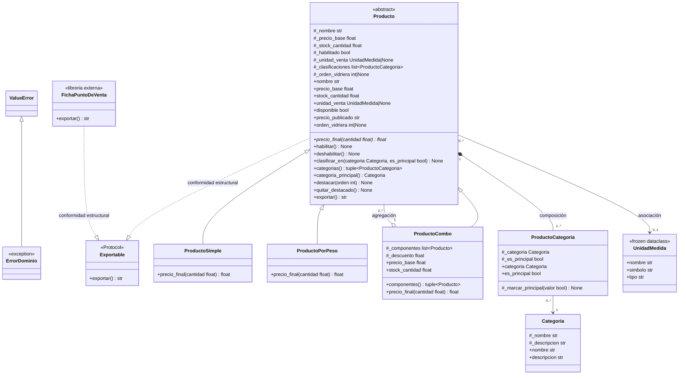

# Diagrama de Clases UML Final — Food Store

## 1. Diagrama de Clases (Mermaid)

```mermaid
classDiagram
    class ErrorDominio {
        <<exception>>
    }
    class Exportable {
        <<Protocol>>
        +exportar() str
    }
    class Producto {
        <<abstract>>
        #_nombre str
        #_precio_base float
        #_stock_cantidad float
        #_habilitado bool
        #_unidad_venta UnidadMedida|None
        #_clasificaciones list~ProductoCategoria~
        #_orden_vidriera int|None
        +nombre str
        +precio_base float
        +stock_cantidad float
        +unidad_venta UnidadMedida|None
        +disponible bool
        +precio_publicado str
        +orden_vidriera int|None
        +precio_final(cantidad float)* float
        +habilitar() None
        +deshabilitar() None
        +clasificar_en(categoria Categoria, es_principal bool) None
        +categorias() tuple~ProductoCategoria~
        +categoria_principal() Categoria
        +destacar(orden int) None
        +quitar_destacado() None
        +exportar() str
    }
    class ProductoSimple {
        +precio_final(cantidad float) float
    }
    class ProductoPorPeso {
        +precio_final(cantidad float) float
    }
    class ProductoCombo {
        #_componentes list~Producto~
        #_descuento float
        +precio_base float
        +stock_cantidad float
        +componentes() tuple~Producto~
        +precio_final(cantidad float) float
    }
    class ProductoCategoria {
        #_categoria Categoria
        #_es_principal bool
        +categoria Categoria
        +es_principal bool
        #_marcar_principal(valor bool) None
    }
    class Categoria {
        #_nombre str
        #_descripcion str
        +nombre str
        +descripcion str
    }
    class UnidadMedida {
        <<frozen dataclass>>
        +nombre str
        +simbolo str
        +tipo str
    }
    class FichaPuntoDeVenta {
        <<libreria externa>>
        +exportar() str
    }

    ValueError <|-- ErrorDominio
    Producto <|-- ProductoSimple
    Producto <|-- ProductoPorPeso
    Producto <|-- ProductoCombo
    Producto "1" *-- "1..*" ProductoCategoria : composición
    ProductoCombo "1" o-- "2..*" Producto : agregación
    Producto "0..*" --> "0..1" UnidadMedida : asociación
    ProductoCategoria "0..*" --> "1" Categoria
    Producto ..|> Exportable : conformidad estructural
    FichaPuntoDeVenta ..|> Exportable : conformidad estructural
```

