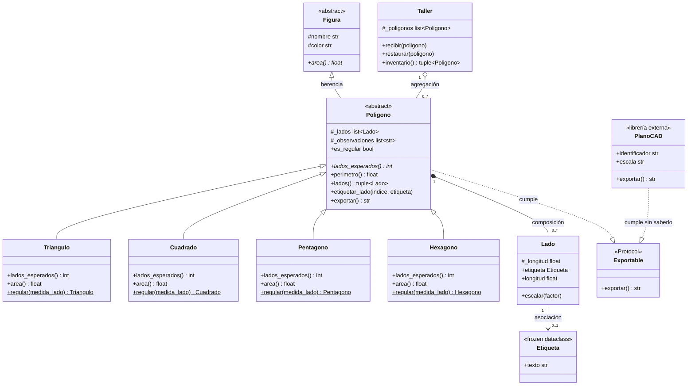

# Diagrama de Clases UML — Modelo Final

```mermaid
classDiagram
    class Exportable {
        <<Protocol>>
        +exportar() str
    }

    class Figura {
        <<abstract>>
        #nombre str
        #color str
        +area()* float
    }

    class Poligono {
        <<abstract>>
        #_lados list~Lado~
        #_observaciones list~str~
        +lados_esperados()* int
        +perimetro() float
        +lados() tuple~Lado~
        +etiquetar_lado(indice, etiqueta)
        +exportar() str
        +es_regular bool
    }

    class Lado {
        #_longitud float
        +etiqueta Etiqueta
        +longitud float
        +escalar(factor)
    }

    class Etiqueta {
        <<frozen dataclass>>
        +texto str
    }

    class Taller {
        #_poligonos list~Poligono~
        +recibir(poligono)
        +restaurar(poligono)
        +inventario() tuple~Poligono~
    }

    class Triangulo {
        +lados_esperados() int
        +area() float
        +regular(medida_lado)$ Triangulo
    }

    class Cuadrado {
        +lados_esperados() int
        +area() float
        +regular(medida_lado)$ Cuadrado
    }

    class Pentagono {
        +lados_esperados() int
        +area() float
        +regular(medida_lado)$ Pentagono
    }

    class Hexagono {
        +lados_esperados() int
        +area() float
        +regular(medida_lado)$ Hexagono
    }

    class PlanoCAD {
        <<librería externa>>
        +identificador str
        +escala str
        +exportar() str
    }

    %% Relaciones de herencia
    Figura <|-- Poligono : herencia
    Poligono <|-- Triangulo
    Poligono <|-- Cuadrado
    Poligono <|-- Pentagono
    Poligono <|-- Hexagono

    %% Relaciones estructurales y ciclo de vida
    Poligono "1" *-- "3..*" Lado : composición
    Lado "1" --> "0..1" Etiqueta : asociación
    Taller "1" o-- "0..*" Poligono : agregación

    %% Contratos estructurales (Protocol)
    Poligono ..|> Exportable : cumple
    PlanoCAD ..|> Exportable : cumple sin saberlo
```
